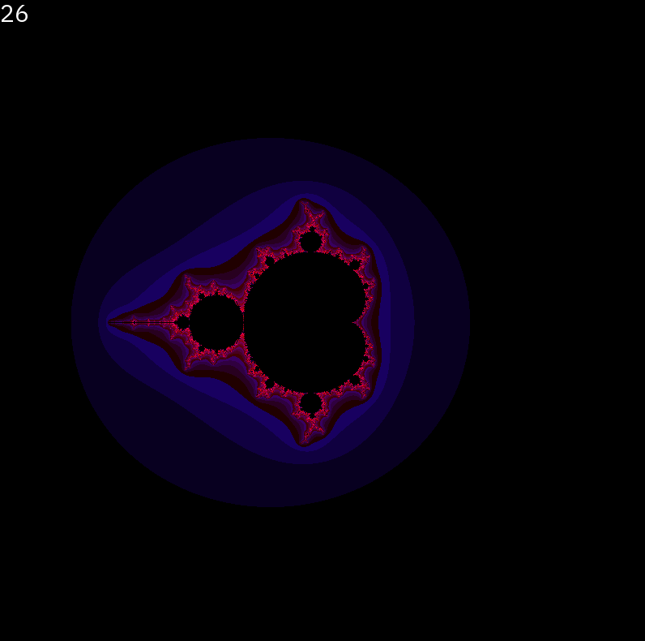

# mandelbrot

A little demonstration of SIMD optimizations.

## Table of contents
* [Prerequisites](#prerequisites)
* [Installation and setup](#installation-and-setup)
* [Usage](#usage)
* [Perfomance](#perfomance)

## Prerequisites
* `git`
* `make`
* `g++`
* `SFML`
* CPU with support of AVX instruction set(see more [here](https://www.laruence.com/sse/ "Intel Intrinsic's Guide"))

Program was built and tested on Linux 6.1.21-1-MANJARO.

## Installation and setup
1. Download all source files into one folder:
```
$ git clone https://github.com/princess-oregano/mandelbrot
```
2. Open the subfolder with source files and build with Make:
```
$ cd mandelbrot/
$ make
```
The program will build and run.

3. To remove all object files:
```
$ make clean
```
4. To remove all files built by `make`:
```
make distclean
```

## Usage
Mandelbrot has simple interface:
* Use `+` and `-` to regulate image scale
* Use arrows to regulate position 

## Perfomance

Without AVX optimization:


With AVX optimization:


